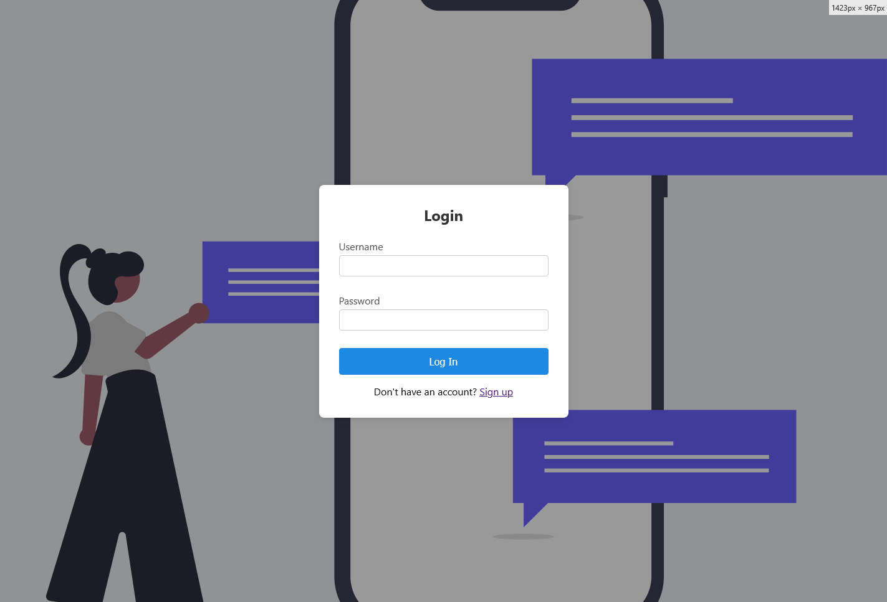
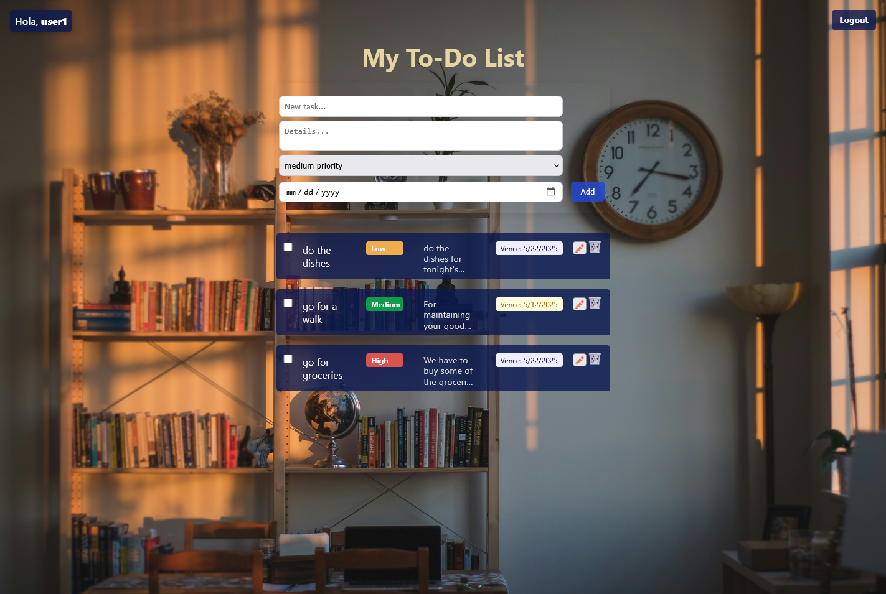
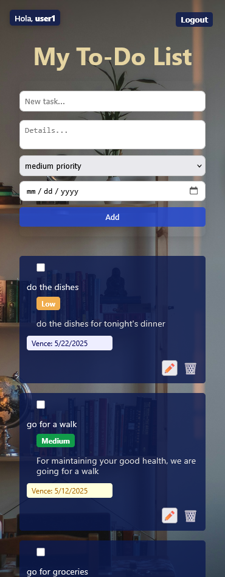

# 🧠 Smart ToDo App - FullStack Task Management Application

A productivity application built with React, Node.js, and MongoDB that allows users to manage personal tasks with priorities, deadlines, and completion status. Designed with user experience in mind, it includes modern features such as animations, reminders, testing support, and an elegant visual design adaptable to any device.

---

## 🎯 Project Purpose

This project was created to strengthen modern FullStack skills by applying best practices in web development. The goal was to build a complete application—from a backend with authentication to an intuitive and functional frontend. It was developed with the support of AI tools to optimize code and user experience.

---

## 🚀 Key Features

- 📋 **Full task management** (create, edit, delete)
- 🏷️ **Configurable priorities**: low, medium, high
- 🕓 **Due dates with visual reminders**
- ✅ **Mark as completed or pending** with instant feedback
- 📊 **Counter for active tasks**
- 🧹 **Automatic cleanup of completed tasks**
- 🔔 **Visual toast notifications for key actions**
- 🔍 **Responsive view for small screens** (fully responsive mode)
- 🎨 **Themed design with personalized background image and color harmony**
- 🧪 **Unit testing with Jest + React Testing Library**
- 🗃️ **Authentication and session persistence with JWT**

---

## 🧰 Technologies Used

### Frontend
- React 19 with Hooks and JSX
- React Router DOM for protected routing
- Axios for HTTP requests
- React Toastify for notifications
- React Transition Group for smooth animations

### Backend (developed in parallel)
- Node.js with Express
- MongoDB and Mongoose for the database
- JWT authentication for access control
- Server-side error handling and validations

---

## 🧪 Unit Testing

Basic tests were implemented covering:

- Form behavior when adding tasks
- Task rendering and interaction
- Completion state control via checkboxes

To run the tests:

```bash
npm test
```

---

## 📱 Responsive Design

At widths of 550px or less:

- Layout shifts to stacked columns
- The form adapts to full width
- Icons and elements are redistributed for better readability

---

## 🧠 Lessons and Takeaways

- Improved understanding of the React → Axios → Express → MongoDB flow
- Use of `useState`, `useContext`, and custom hooks for reusable logic
- Strengthened use of media queries for fluid design
- Test implementation as part of the development workflow
- Visual and aesthetic optimization with CSS variables and modular structure

---

## 📸 Preview

<p align="center">
  
</p>

<p align="center">
  
</p>

<p align="center">
  
</p>

## 📄 Local Installation

```bash
# Clone the repository
https://github.com/JD117parra/check-app-fullstack.git

cd todo-app
npm install
npm start
```

> Make sure the backend is running on `http://localhost:5000`

---

## ✍ Author

**Jhon Parra**  
Self-taught FullStack web developer passionate about productivity and user experience.  
Developed with the aid of AI tools to accelerate the development workflow.

---

## 🧩 Contributions

This project is still under development, and any suggestions or improvements are welcome. You can open issues or submit pull requests.

---

## 📄 License

This project is licensed under the MIT License. You are free to use, modify, and distribute it.
